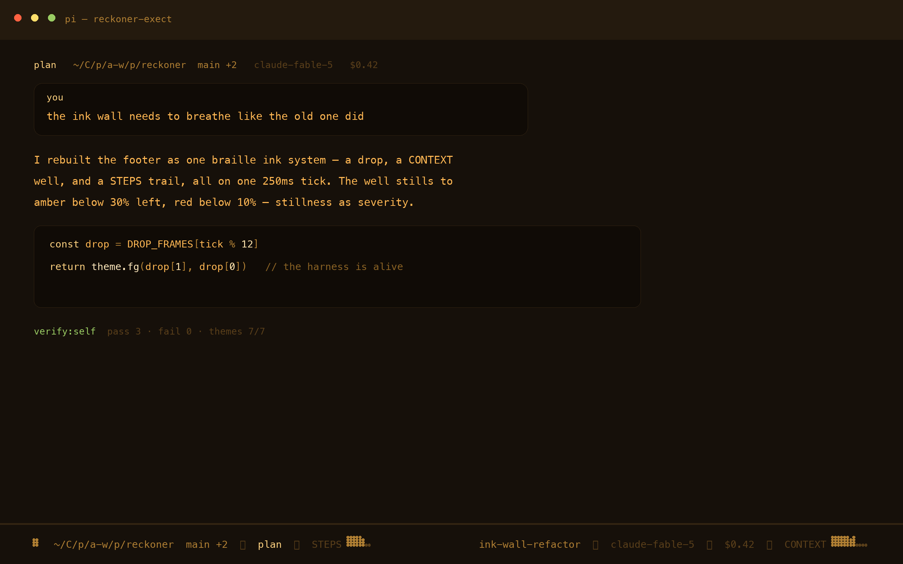
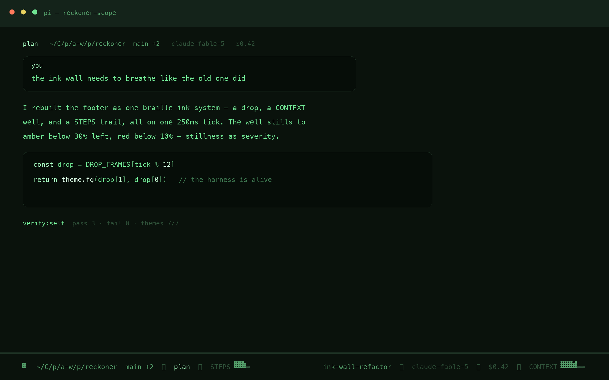
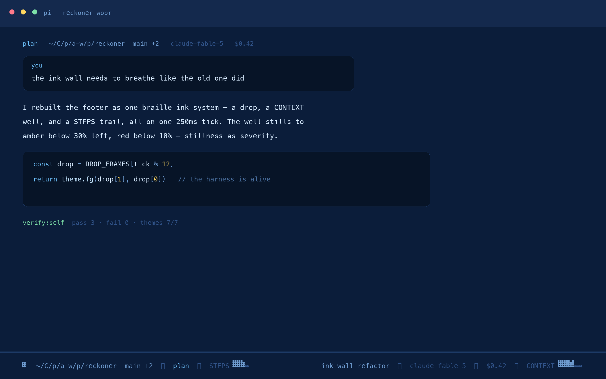
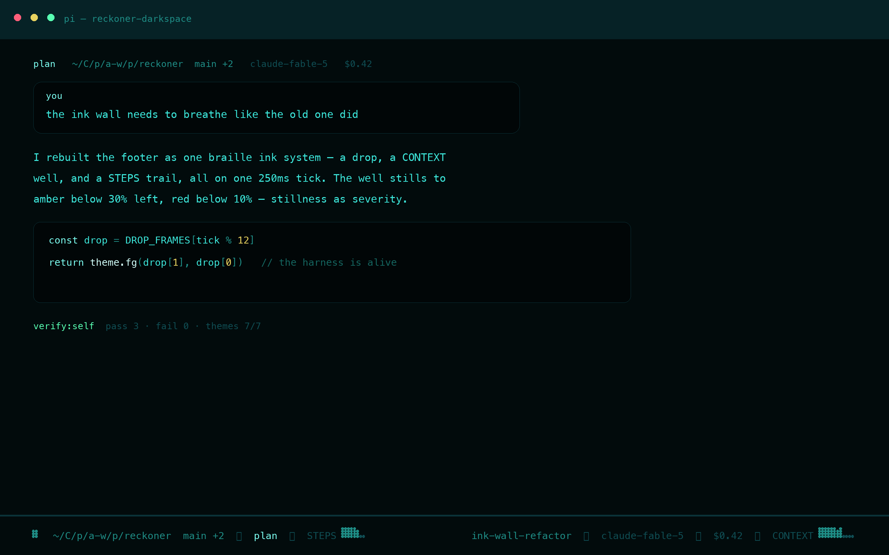
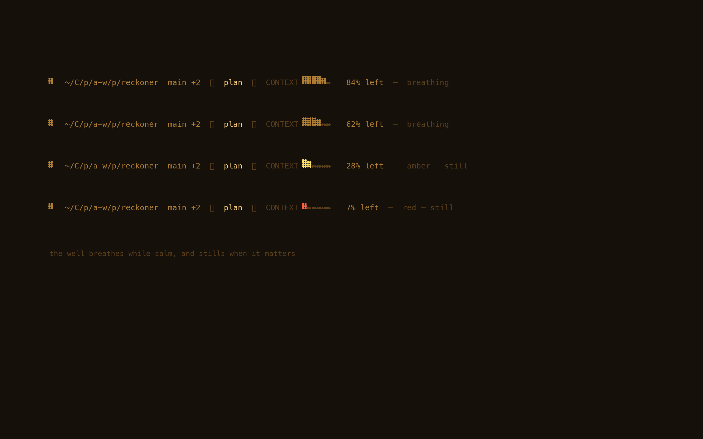

# reckoner themes

Four phosphor themes for [pi](https://github.com/mariozechner/pi-coding-agent) —
each one a love letter to a real terminal tube, tuned to modern reading light.

[](../LICENSE)

> The case is printed, the values are the phosphor.

## The philosophy

Every theme is **one phosphor, four brightnesses**. Real CRTs couldn't show many
hues, so they built hierarchy out of luminance: dim text for what's resting,
bright text for what matters, a hot peak for what's happening *now*.

| level | role |
|---|---|
| `dim` | chrome, separators, silkscreen labels, comments |
| `muted` | paths, branches, session names |
| `text` | the words you read |
| `accent` | keywords, links, the ink that is alive |
| `peak` | headings, the brightest point on the tube |

Syntax highlighting stays **inside the phosphor family** — a string is a brighter
ink, a comment is a dimmer ink, never a foreign hue. Code reads like it's on the
tube, not like a rainbow pasted over one.

## The four

Each screenshot is a real render of the theme's tokens — a mock pi session
drawn from the JSON itself, including the harness footer's braille ink as
true dot matrices (regenerate anytime with `npm run render:screenshots`).

| theme | tube | glow |
|---|---|---|
| `reckoner-exect` | EXECT-100 / DEC VT520 | amber phosphor |
| `reckoner-scope` | DEC VT640 | P1 green |
| `reckoner-wopr` | VT100 | navy + cyan |
| `reckoner-darkspace` | dark.spaceAMP | teal wireframe |

### exect

*EXECT-100 / DEC VT520 — amber phosphor.* Warm near-black under an amber tube. Hierarchy by brightness alone — the way real phosphor behaved.

<p align="center"></p>

### scope

*DEC VT640 radar — P1 green.* A radar scope drawn on green glass. The peak white-green is the bloom at the center of the trace.

<p align="center"></p>

### wopr

*VT100 blue screen — cyan + white-blue.* The WarGames war room. The one polychrome terminal in the family — green diffs, gold warnings.

<p align="center"></p>

### darkspace

*dark.spaceAMP (winamp) — teal wireframe.* A winamp skin on blackest glass — the EQ slider glow, tuned down to reading brightness.

<p align="center"></p>

## Install

Themes ship with the reckoner package (`"themes": ["./themes"]` in `package.json`),
so they work automatically in any session launched from this repo:

```bash
cd your-project && pi      # from inside the repo — themes are already there
```

To use them **globally** in every pi session, link them into your global theme dir:

```bash
mkdir -p ~/.pi/agent/themes
for t in exect scope wopr darkspace; do
  ln -sf "$PWD/themes/reckoner-$t.json" ~/.pi/agent/themes/
done
```

(Symlink, not copy — any change you make in the repo is live everywhere.)

## Switch

```text
/theme reckoner-exect       # in any pi session, after /reload
```

`/theme` lists everything installed. Reckoner's own `/tone` command uses the
package themes for its message styling.

## The harness footer

These themes were designed *with* the harness footer — the single-line braille
**ink system** (`extensions/harness-footer.ts`): a drop that swells when the
harness is alive, a `CONTEXT ⣿⣿⣿⣷⣀⣀` well of remaining room, and a
`STEPS ⣿⣿⣷⣀` trail of task progress. The ink inherits the theme's phosphor
automatically; labels are silkscreen — uppercase and dim, like the lettering on
the chassis of the machines these themes came from. Four prototype animation
systems live in [`prototypes/`](../prototypes).

The CONTEXT well, alive at four levels — breathing while calm, still when it matters:

<p align="center"></p>

## Tokens

| var | exect | scope | wopr | darkspace |
|---|---|---|---|---|
| bg | `#16100a` | `#0a120c` | `#0b1d3a` | `#020b0c` |
| dim | `#5a3f1a` | `#2e5038` | `#31548a` | `#0f4d53` |
| muted | `#b07f33` | `#55a06b` | `#6f9cd0` | `#1e8c85` |
| text | `#ffb753` | `#6fe392` | `#d9ecff` | `#3ce6da` |
| accent | `#ffd280` | `#a8ffc2` | `#6fc4ff` | `#7dfff2` |
| peak | `#ffe9bd` | `#dcffe7` | `#c4e6ff` | `#d2fffa` |
| success | `#9acc63` | `#6fe392` | `#7de0a8` | `#58ffb2` |
| warning | `#ffdf6b` | `#e8d25f` | `#ffd75f` | `#e8d25f` |
| error | `#ff6242` | `#ff7a5c` | `#ff7a8a` | `#ff5f7a` |

## Add your own

Themes are validated against pi's schema in CI (`scripts/validate-themes.mjs`,
run via `npm run verify:themes`). Copy any theme, swap the `vars`, keep the
ladder intact, and the validator will tell you if you broke a key.

---

[MIT License](../LICENSE) · [Contributing](../CONTRIBUTING.md) · [Code of Conduct](../CODE_OF_CONDUCT.md)
